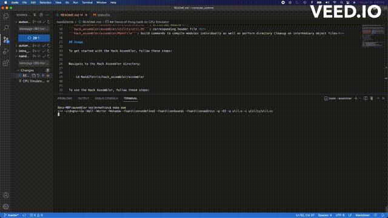

## :floppy_disk:Nand2Tetris 2-Pass Hack Assembler (Project-Centered Course):floppy_disk:

This repository contains the Hack Assembler project from the Nand2Tetris course. The Hack Assembler is a tool used to convert assembly language code written in the Hack assembly language into binary machine code that can be executed by the Hack computer.

## About the Project

The Hack Assembler is part of the Nand2Tetris course, which provides a hands-on approach to building a complete computer system from the ground up. It starts with basic logic gates and progresses to a fully functional computer with a CPU, memory, and I/O devices.

The Hack Assembler specifically focuses on the assembly language used by the Hack computer architecture. It takes assembly code written in the Hack assembly language and translates it into binary machine code. The resulting binary code can be executed directly on the Hack hardware or on the Hack software simulator.

## Directory Description
```hack_assembler/assembler/binary/codegen.cc```: mapping of assembly operators to binary representation <br>
```hack_assembler/assembler/driver/assembler.cc```: main driver file that ingests *.asm and outputs *.hack to be ran as an executable on [CPU_Emulator](https://github.com/KesMath/Nand2Tetris/blob/master/tools/CPUEmulator.sh) <br>    
```hack_assembler/assembler/parser/parsers.cc```: module responsible for parsing assembly instructions<br>
```hack_assembler/assembler/parser/tokens.hh```: header file containing ASCII definitions used to signal assembly instruction types to parser<br>
```hack_assembler/assembler/symbol_table/symboltable.cc```: module containing in-memory storage for user-defined labels<br> 
```hack_assembler/assembler/utility/util.cc```: utilities module<br>
```hack_assembler/assembler/utility/util.hh```: corresponding header file <br>
```hack_assembler/assembler/Makefile```: build commands to compile modules individually as well as perform directory cleanup on intermediary object files<br>    

## Usage

To get started with the Hack Assembler, follow these steps:


Navigate to the Hack Assembler directory:


    cd Nand2Tetris/hack_assembler/assembler


To use the Hack Assembler, follow these steps:


    Run the Hack Assembler using the following command:

    make asm
    make run-all 


The Hack Assembler will output the resulting binary code that's to be run on Hack's CPU Emulator: <br>
```Add.hack```: Adds the constants 2 and 3, and puts the result in R0. <br>
```Max.hack```: Computes max(R0, R1) and puts the result in R2. <br>
```MaxL.hack```: Same as above without user-defined symbols <br>
```Rect.hack```: Draws a rectangle at the top left corner of the screen. The rectangle is 16 pixels wide,
and R0 pixels high. Before running this program, put a non-negative value in R0.<br>
```RectL.hack```: Same as above without user-defined symbols<br>
```Pong.hack```: A classical single-player arcade game. A ball bounces repeatedly off the screen’s "walls."
The player attempts to hit the ball with a paddle, by pressing the left and right arrow keys.<br>
```PongL.hack```: Same as above without user-defined symbols <br>

## Demo of Pong.hack on CPU Emulator
